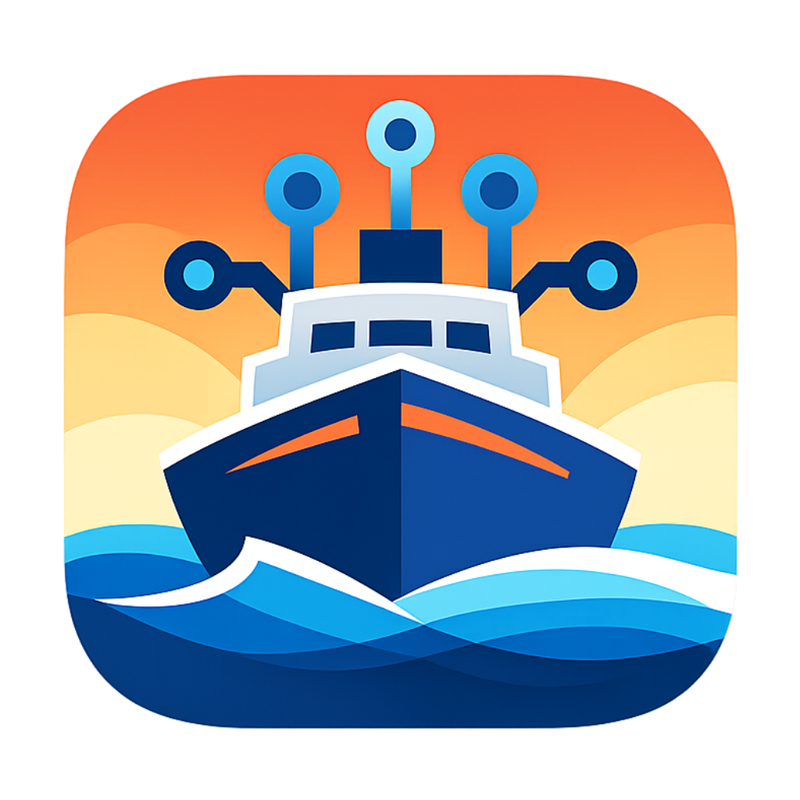

<p align="center">
  
</p>

<h1 align="center">ShipDeck</h1>
<p align="center">
  Desktop project cockpit built with Electron, React, and TypeScript.
</p>

<p align="center">
  Manage local projects, run per-project AI terminal sessions (Codex/Claude), and keep a secure localhost live preview in one place.
</p>

## Overview

ShipDeck is a desktop workspace for juggling multiple projects quickly:

- Track and switch projects from a single sidebar
- Launch server + shell terminals per project
- Open and resume Codex/Claude sessions
- Keep a secure embedded localhost preview synced to the active project/session

## Tech Stack

- Electron (main + preload + renderer split)
- React 19 + TypeScript
- Vite (renderer)
- `node-pty` (terminal sessions)
- `better-sqlite3` (local metadata state)
- `zod` (IPC payload validation)

## Prerequisites

- Node.js 20+
- pnpm 9+
- Windows/macOS/Linux (scripts are currently Windows-friendly but not Windows-only)

## Quick Start

```bash
pnpm install
pnpm dev
```

`pnpm dev` starts:

- Vite renderer dev server
- `tsup` watch for main
- `tsup` watch for preload
- Electron app process

## Scripts

| Command | Purpose |
| --- | --- |
| `pnpm dev` | Start full development environment |
| `pnpm build` | Build renderer + main + preload into `dist/` |
| `pnpm typecheck` | Run TypeScript type checks |
| `pnpm lint` | Run ESLint |
| `pnpm test` | Run Vitest |
| `pnpm rebuild:native` | Rebuild native modules (better-sqlite3) |
| `pnpm rebuild:pty` | Rebuild `node-pty` |

## Architecture

```text
src/
  main/        Electron main process, IPC handlers, DB, PTY, webview manager
  preload/     Secure bridge (`window.api`) exposed to renderer
  renderer/    React UI (App + components + styles + utilities)
  shared/      Shared IPC channels, schemas, and common types
tests/         Vitest tests for core logic
```

### Runtime Ownership

- Main process owns:
  - SQLite repository (`src/main/db`)
  - PTY lifecycle/streaming (`src/main/pty/manager.ts`)
  - Webview bounds, visibility, and target loading (`src/main/webview/manager.ts`)
- Renderer owns:
  - Project/session UI state and interactions
  - Terminal tab selection and modal flows
  - All main-process access via `window.api` only

## Conventions

- Validate IPC payloads in main process with Zod before side effects.
- Do not access Node APIs directly in renderer; always use preload bridge.
- Session title changes are user-driven via rename flow.
- On first load, ShipDeck auto-opens the first project’s first session (when available).

## Common Dev Task

### Add a new IPC endpoint

1. Add channel in `src/shared/ipc.ts`
2. Add schema in `src/shared/schemas.ts` (if needed)
3. Implement handler in `src/main/index.ts`
4. Expose function in `src/preload/index.ts`
5. Add typing in `src/renderer/global.d.ts`

## Troubleshooting

- Terminal not starting:
  - Verify shell availability
  - Run `pnpm rebuild:pty`
- Electron launch issues after dependency changes:
  - Run `pnpm rebuild:native` and retry
- No localhost preview:
  - Confirm project dev command starts and binds a local port

## Commit Hygiene

Ignored artifacts include:

- `node_modules/`, `dist/`, `.vite/`, `.pnpm-store/`
- logs and coverage output
- local trace/heap captures (`Trace-*.json`, `Heap-*.heaptimeline`)

Before pushing:

```bash
pnpm typecheck && pnpm lint && pnpm test && pnpm build
```
